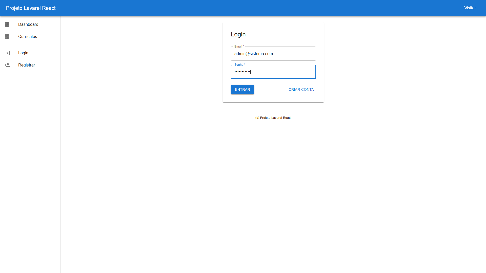
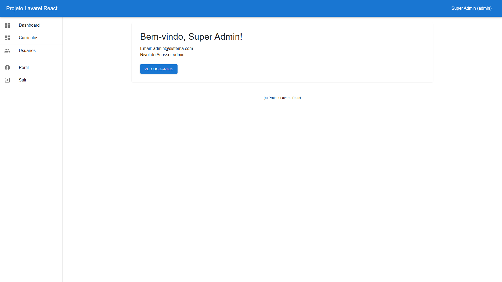
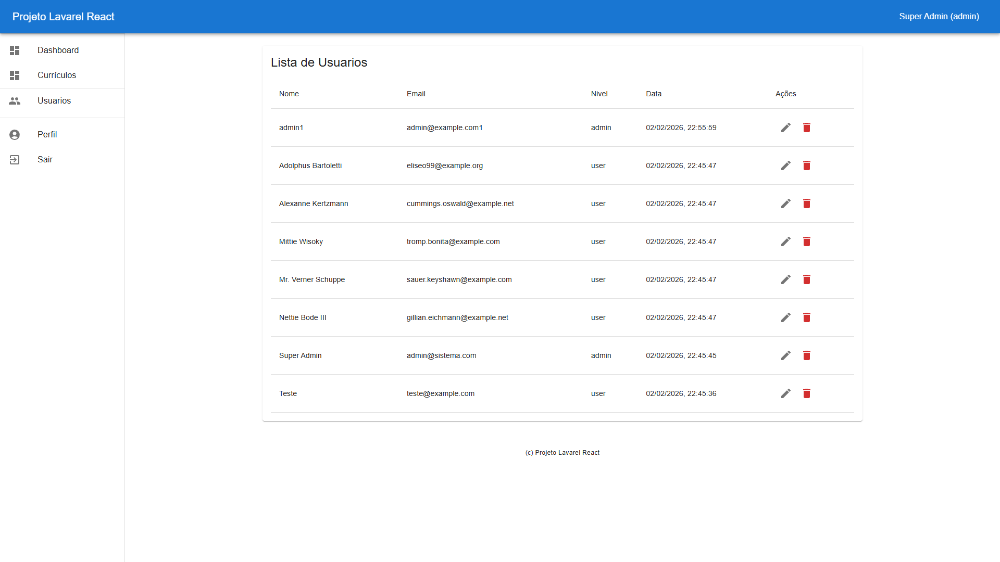
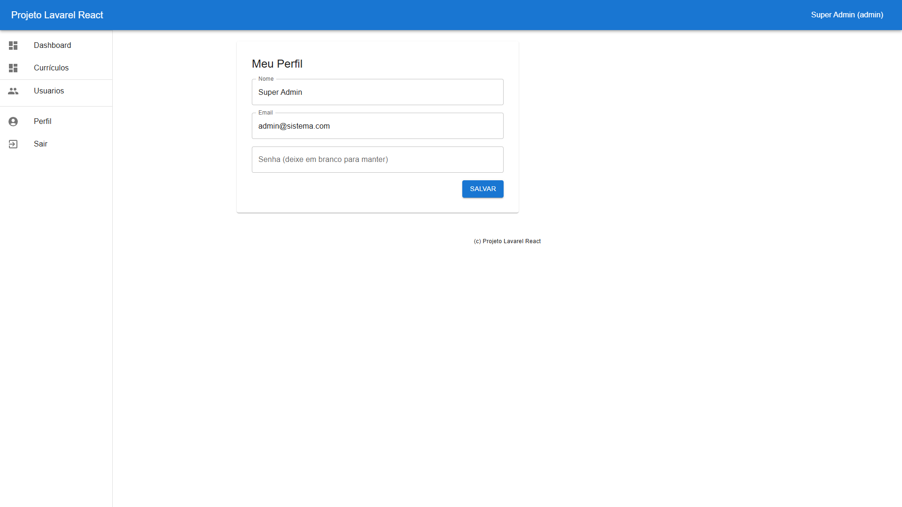
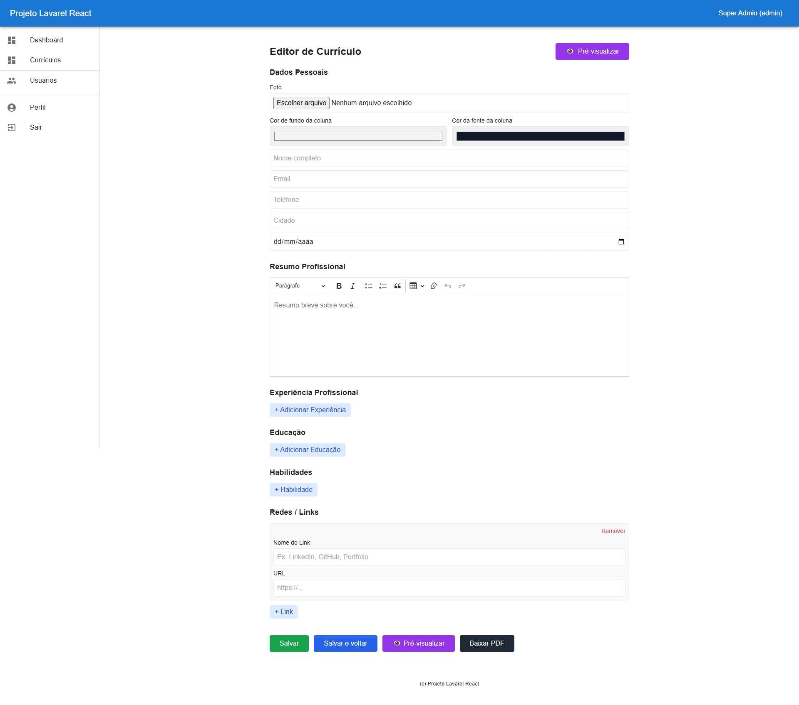
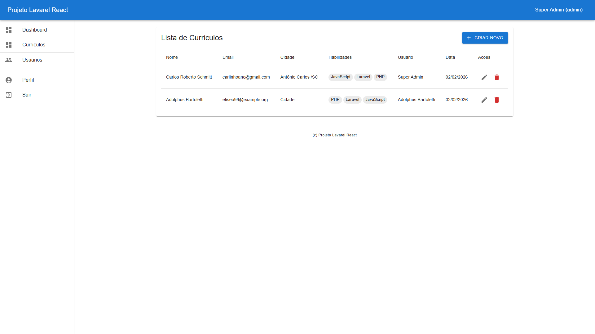

# Projeto Laravel React

Repositório para o projeto fullstack com backend em Laravel (Sanctum) e frontend em React + Vite + MUI.

## Visão geral

- Backend: Laravel 12 com Sanctum para autenticação (services rodando via Docker).
- Frontend: Vite + React + TypeScript + Material UI.
- Docker Compose inclui serviços para backend, frontend, MySQL e phpMyAdmin.

## Campos e formatos do currículo

- Data de nascimento: salva no banco em `birth_date` e exibida no preview.
- Períodos de experiência e educação: usar formato MM/AAAA.
- Telefone: máscara no frontend no formato (99) 99999-9999.

## Início rápido (desenvolvimento)

Pré-requisitos: Docker e Docker Compose instalados.

1. Suba os serviços:

   docker compose up --build

2. Frontend (HMR): http://localhost:3000/
3. Backend (API): verifique `docker-compose.yml` para mapeamento de portas (geralmente `:8000` ou conforme configuração).

## Testes

  docker compose exec backend sh -c "cd backend && composer install && php artisan test"

  docker compose exec frontend sh -c "cd frontend && npm ci && npm run build"

## GitHub Actions

Inclui um workflow básico (`.github/workflows/ci.yml`) que roda os testes do backend (PHPUnit) e faz build do frontend em push e PR.

## Contribuindo

Sinta-se à vontade para abrir issues ou pull requests. Para mudanças significativas, abra uma issue primeiro para discutir o plano.

## Screenshots

### 1. Login

### 2. Login preenchido

### 3. Dashboard

### 4. Lista de usuários

### 5. Perfil do usuário

### 6. Edição de currículo

### 7. Lista de currículos

### 8. Preview (scrolled)

Feito com ?? por carlinhoanc.
